# greenwood-library-website

In this project, we would again explain how you can create and clone new repository, and working with branches in Git. We also showcase how you can stage,commit and push the changes you made in your branches. And finally, we explain how you can craete pull request and merge them after resolving any potential conflict.

1. first of all we created a new repository and named it "greenwood-library-website" and initialize it with a README.md fle. 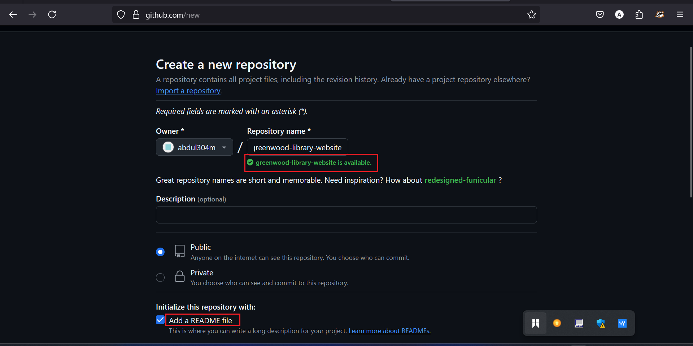. And then clone the new repository into our local machine by running this command "git clone and the paste the rep url. 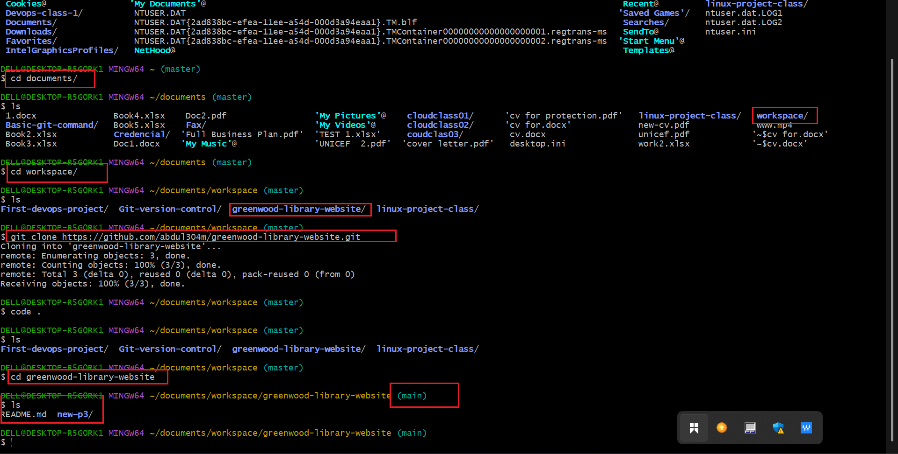.

2. Then in the "main branch" we created the following files : Home.html,about_us.html,Events.html and contact_.html by running this command "echo " " > name of the file and added a content in each file. 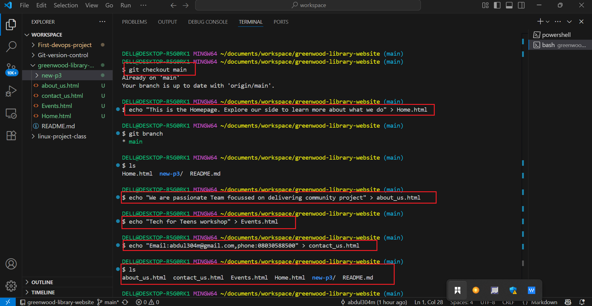.

3. After that we now stage,commit and push all the chnages directly into our "main branch". And this is done by running this command "git status" which we use to check the current stateof our working directory. "git add ." which is used to stage all the changes in the working directory. Then git commit -m " " which is used to save the changes to the repository. 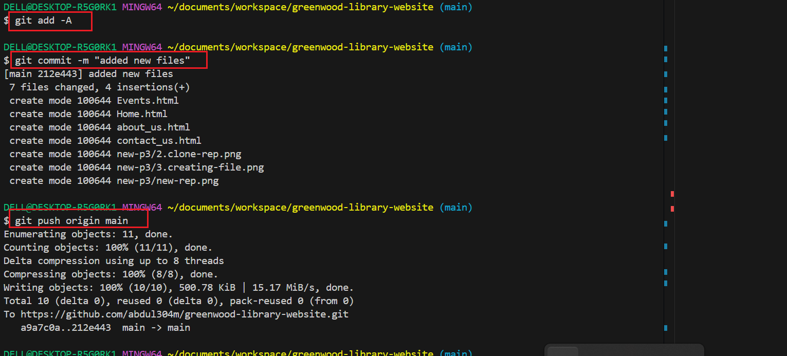

## Morgan's work: Adding Books Review

- In this step we created a branch for morgan and named it "Add-book-reviews" by running this command "git checkout -b Add-book-reviews" 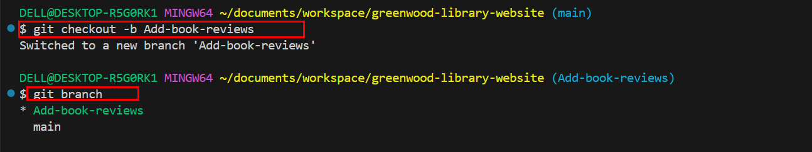 and this took us directly into the branch and added a new file named "book-reviews.html" to represent the book review section by running the same command we used when we opened files in the main branch.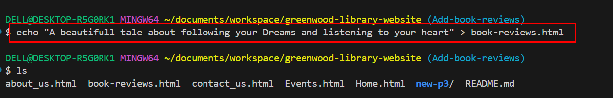

- we then stage,commit and push the changes into the branch by running these commands : "git status", "git add .", "git commit -m "Add book review section" and "git push origin add-book-reviews, in which we successfully push the branch into the Github. 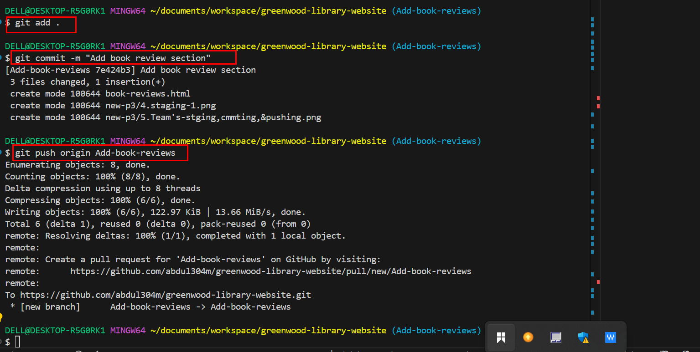.

- After pushing the branch into the Github, we then raised a pull request for morgan's by navigating into our repository .

- we clicked on main on the repository interface and choose the branch where morgan's work were kept. 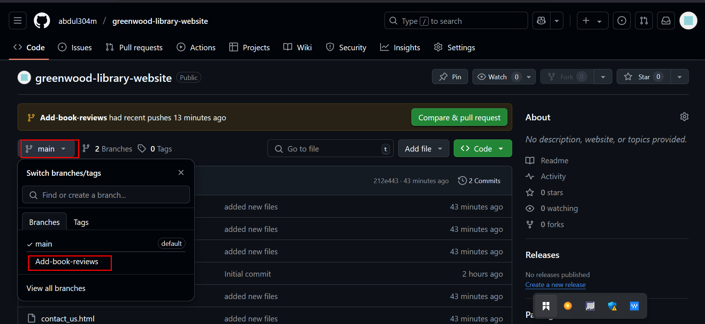, created the pull request 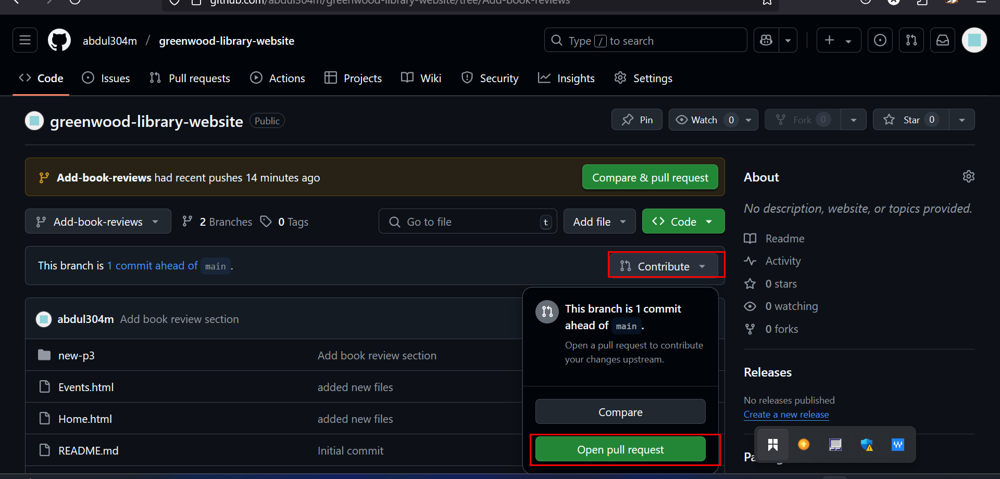 and that took us to the a new page where add the title and description of why we created the pull request 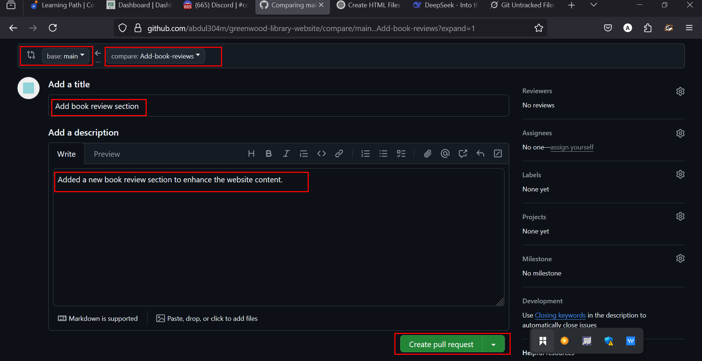. And we successfully merged morgan's work to the main branch. 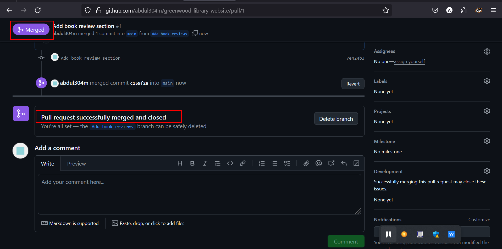

## Jamie's work: Updating Events page.

- In this step, we incorporate Jamie's work on the event page into the update-events branch and pull the latest changes from the main branch by folloeing these process :

a- craeted a branch and named it "update-events" with this command "git checkout -b update-events" and this tok us directly into the branch. 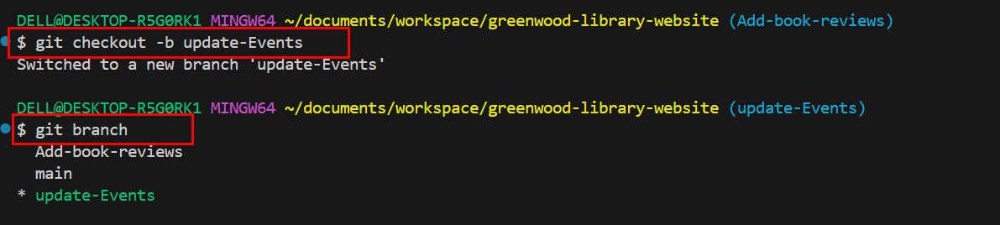

b- Then we pull the latest changes from main into the update-events bu running this command " git pull origin main".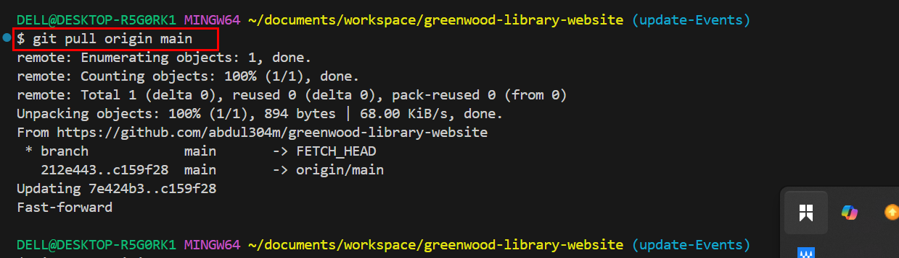

c- Then we stage, commit and push the changes to the branch. 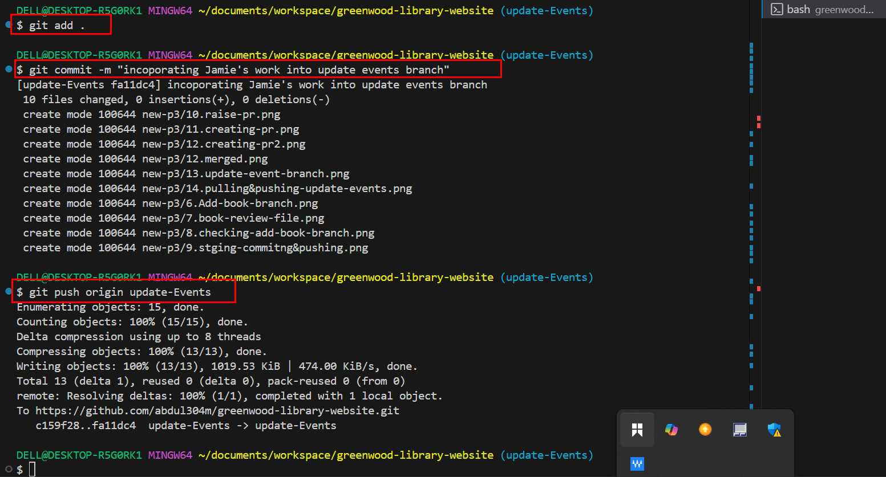.

d- Then we raised the pull request by going into our Github repository, navigate to the pull request tab and click New pull request. and we succcessfully merged jamie's work. 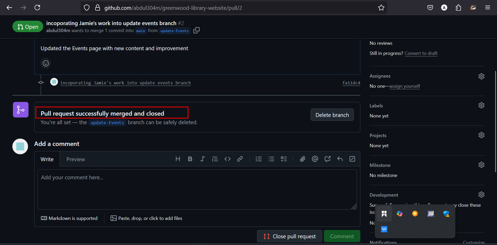